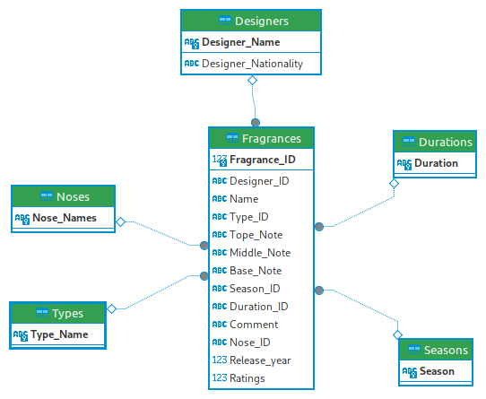

# SQL
Practice on SQL

# Frangrance_SQL
To practice SQL on self created Fragrance Database

  

# Overview
To practice SQL, I create different csv files to produce a database for fragrances I smelt or used in the past.

It has been used the main SQL Keywords, Operators, & Statements such as
- [x] SELECT
- [x] JOIN
- [x] CREATE TABLE
- [x] DISTINCT
- [x] WHERE
- [x] INSERT INTO
- [x] Regular Expression patterns

# Schema

It has been tried to create a database with a star structure as it can be observed on the image.

- Fragrance(**Fragrance_ID**, #Designer_ID, Name, #Type_ID, Top_note, Middle_note, Base_note, #Season_ID, #Duration_ID, Comment, #Nose_ID, Release_year, Note)
- Type(**Type_ID**, Type_name)
- Duration(**Duration_ID**, Duration)
- Designer(**Designer_ID**, Designer_Name)
- Season(**Season_ID**, Season_name)
- Nose(**Nose_ID**, Name)

It has been created directly via csv files. It will be perform the same creation using SQL command for the sake of practice too.

The schema and SQL commands have been written and tested in DBeaver and DB Browzer for sqlite.

Finally it has been attempted to make a Database following the Normalisations Check (check Nomalisation.md), to make it robust to different scenarios, such as deleting, adding, modifying the database.

# Queries examples
In the folder Scripts, it can be found the command to create the Tables and different queries examples.
